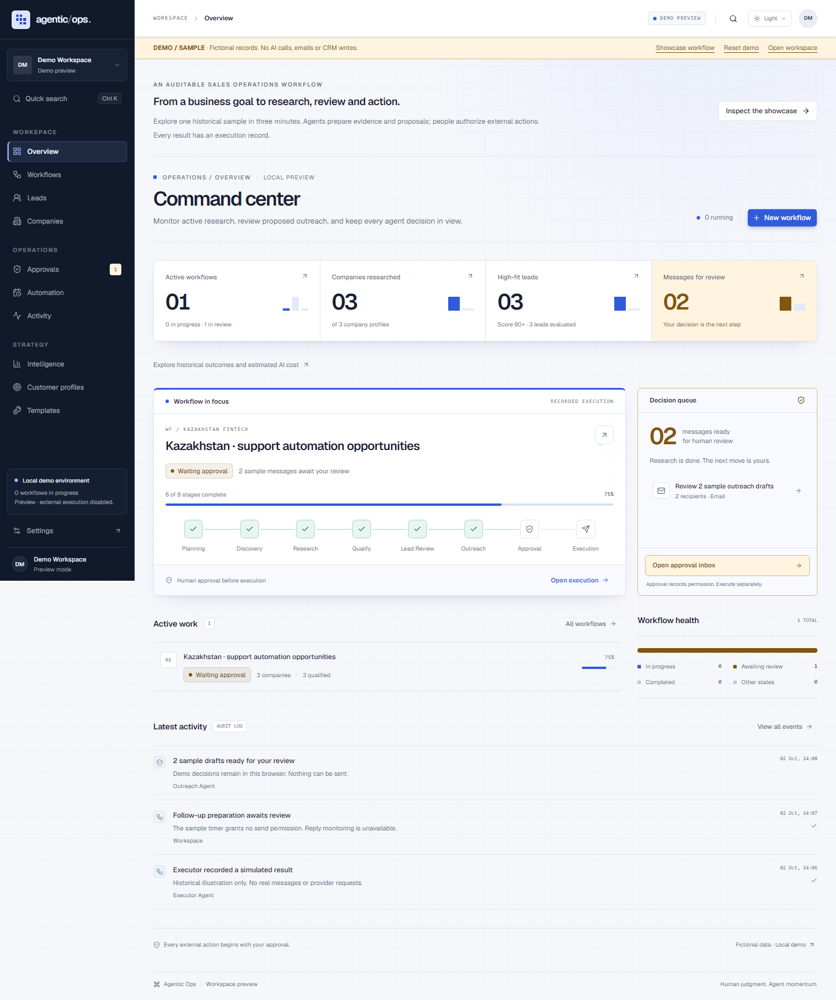
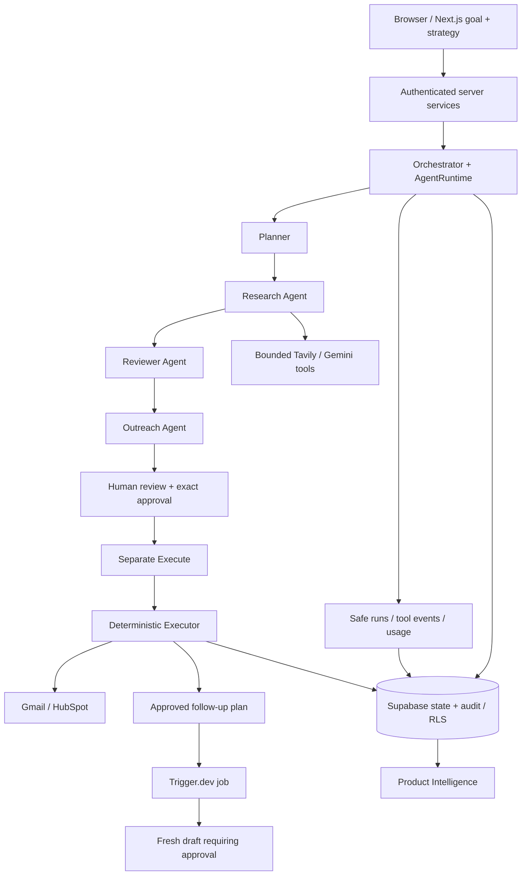

# Agentic Ops

**Agentic AI sales operations platform.** Agentic Ops turns natural-language sales goals into auditable workflows for company research, lead qualification, personalized outreach, human approval, execution and follow-up.

[Live demo](https://agentic-ops-gold.vercel.app/demo/dashboard) · [Workspace sign-in](https://agentic-ops-gold.vercel.app/sign-in) · [Deployment evidence](docs/deployment-progress.md)



## What it does

An operator defines a goal, optionally using a saved Ideal Customer Profile (ICP) and workflow template. The platform plans tasks, researches source-supported companies, scores opportunities, reviews evidence and prepares outreach. The operator inspects the draft and approves the exact action. A deterministic Executor then performs a separately requested execution.

This is an operational workspace built around tasks, tables, evidence, logs and approval queues. The public `/demo` showcase lets a reviewer inspect one complete fictional workflow without credentials or paid API calls.

## Key features

- **Observable execution:** task dependencies, stage status, source citations, safe agent events and inspectable runs.
- **Research and qualification:** bounded web search, structured analysis, explicit score components and independent evidence review.
- **Human approval:** editable drafts, immutable approved revisions, exact account generations and separate Execute.
- **Integrations:** Gmail sending and HubSpot contact proposals with encrypted server-side OAuth credentials.
- **Automation:** opt-in durable continuation, bounded retries, follow-up preparation and targeted reply checks when an eligible existing read grant is available.
- **Intelligence:** persisted-data funnels, workflow comparison, cohort trends and unknown-safe usage/estimated cost.
- **Reusable strategy:** workspace-owned ICPs/templates and immutable historical strategy/qualification snapshots.
- **Portfolio experience:** labelled isolated demo, concise onboarding, dark/light themes and responsive operational screens.

## Demo workflow

> Find Kazakhstan B2B SaaS and fintech companies where AI automation could improve customer support or internal operations. Prepare source-grounded outreach and require approval before sending.

Open `/demo`, then inspect the showcase workflow at `/demo/workflows/kazakhstan-fintech`. Show the plan, company evidence, qualification, review, draft, approval boundary, sample execution history, automation and Intelligence.

Demo records are fictional and clearly labelled. Reserved `.example` contacts and browser-only decisions cannot send email, create CRM contacts, call paid providers or alter a real workspace. New sample workflows remain drafts. See the [three-minute demo guide](docs/demo.md).

## Agent architecture and data flow



The Orchestrator owns state. AgentRuntime supplies bounded retry and telemetry policies; agents produce Zod-validated outputs. Checked database functions save outputs, transitions and audit records atomically. Follow-up timers prepare proposals and grant no sending authority.

Planner can use Gemini or the existing OpenAI Responses adapter. Research, Reviewer and Outreach use Gemini; Tavily supplies evidence. Executor is deterministic and makes no model calls. This repository uses a typed application runtime, not an OpenAI Agents SDK deployment. Read [architecture](docs/architecture.md) and [agent contracts](docs/agents.md).

## Safety and human approval

AI proposes → Human reviews → Human approves → Executor executes.

Approval freezes the exact revision, content, recipient, connection identity/generation and digest. Approval alone performs no provider mutation. Edits after approval create a replacement requiring fresh approval. Gmail, CRM and each new follow-up message have independent gates.

Successful replay returns saved results. Ambiguous external outcomes remain uncertain and cannot silently authorize resend. Gmail acceptance does not prove delivery/read or exactly-once delivery. Workspace RLS, checked server operations, structured evidence validation and server-only credential storage enforce separate trust boundaries. See [security](docs/security.md).

## Observability

Saved runs and activity expose stage/task status, safe tool summaries, timestamps, duration, retries and observed usage. Exact versioned model pricing enables estimated cost; absent telemetry or rates stay unavailable. Intelligence uses workspace-scoped database aggregates with explicit cohort/denominator semantics. Neither a completed agent run nor an approval is treated as proof of an external send.

## Tech stack

| Layer | Implementation |
| --- | --- |
| Product UI | Next.js App Router, React, strict TypeScript, Tailwind CSS, shadcn components, Lucide, Motion |
| Server | Next.js handlers/actions, typed services/repositories, Zod |
| Persistence/Auth | Supabase Auth, PostgreSQL, RLS and versioned checked SQL operations |
| AI/research | Gemini structured output, optional OpenAI Planner, Tavily |
| External execution | Google Gmail and HubSpot OAuth adapters |
| Durable automation | Trigger.dev with signed callbacks and database-owned job state |
| Hosting target | Vercel + Supabase; production acceptance is tracked separately from local verification |

## Local development

Use Node.js 24 and npm for the production target. Installed Next.js requires at least 20.9, but Vercel stopped accepting new Node 20 deployments on 1 October 2026. Use the same supported major locally and in Vercel. See [deployment runtime requirements](docs/deployment.md#app-runtime-and-domain).

```powershell
npm ci
npm run dev
```

Open [localhost:3000/demo](http://localhost:3000/demo) for the public sample. For the authenticated product, run `Copy-Item .env.example .env.local`, replace Supabase/AI placeholders with your own values and apply migrations. Sign in or sign up at `/sign-in`; confirmation uses `/auth/callback`. Configure Supabase Auth Site URL and redirect allowlist for the app origin and its confirmation callback.

New sign-ups with an immediate session open `/onboarding`. Sign-in and email confirmation open `/dashboard`; a live workspace with no workflows sees the same first-run panel there. Choose targeting criteria, review the goal and optional saved ICP/template in the workflow dialog, then create through the existing authenticated action. The next screen is the saved workflow. Onboarding creates no separate execution engine or approval policy.

The public demo works without Supabase. A development-only unconfigured workspace preview is also retained; authenticated production routes require configuration.

## Environment variables

[.env.example](.env.example) groups the complete configuration. The authenticated runtime requires public Supabase URL/publishable key, a server-only Supabase secret, canonical app origin and the selected AI/research credentials. OpenAI is required only for OpenAI Planner; Gemini/Tavily support research and preparation.

Gmail/HubSpot and automation are optional until those paths are needed. OAuth credentials, token encryption key, AI keys and job signing secret must never use a `NEXT_PUBLIC_` prefix. Exact verified `AI_MODEL_PRICING_JSON` enables estimated costs; empty pricing means unknown. Never commit `.env.local`.

See [deployment environment inventory](docs/deployment.md#environment-inventory) for names, scopes, callback setup and recovery considerations.

## Supabase setup and migrations

For an isolated local stack, install the Supabase CLI and a Docker-compatible runtime:

```powershell
npx supabase@2.119.0 start
npx supabase@2.119.0 db reset
npx supabase@2.119.0 status
```

`db reset` recreates the **local** database and runs the optional local `supabase/seed.sql`. It creates no login-capable user. The public portfolio demo uses a separate application fixture and requires no database seed.

For a hosted development project:

```powershell
npx supabase@2.119.0 login
npx supabase@2.119.0 link --project-ref YOUR_PROJECT_REF
npx supabase@2.119.0 migration list --linked
npx supabase@2.119.0 db push --linked --dry-run
npx supabase@2.119.0 db push --linked
```

Do not reset hosted data or use `--include-seed`. Apply versioned files from `supabase/migrations` in order; corrective changes belong in new migrations. Workspace bootstrap occurs on authenticated entry.

## Background jobs

Automation is disabled by default. Configure a Trigger.dev project/environment, matching app/worker signing secret and reachable canonical app origin; register the worker before enabling `AUTOMATION_ENABLED=true`.

```powershell
# In a second terminal after provider/login configuration:
npm run automation:dev
```

The worker receives only job references and needs only the signing secret/app origin. App credentials stay on the Next.js server. With automation disabled, visible workflow pages continue bounded synchronous steps; reopening resumes saved progress. Follow-up jobs create fresh approval proposals. See [worker preparation](docs/deployment.md#background-worker).

## Testing

```powershell
npm test
npm run lint
npm run typecheck
npm run build
npm run verify:env
npm run verify:client-secrets
npm run verify:source-secrets
npm run report:client-bundles
```

Unit tests mock paid APIs and provider mutations. Nine transaction-rollback SQL suites cover Planner, Research, Outreach, Executor, Automation, Observability, strategy, Intelligence and [security schema/grants](supabase/tests/security_audit.sql). Run them **sequentially** on a migrated development database, for example:

```powershell
npx supabase@2.119.0 db query --linked --file supabase/tests/planner_runtime.sql
```

The remaining suites are in `supabase/tests`; use staging/development for rollback fixtures. Read-only scripts inspect an existing compatible workflow without new provider calls:

```powershell
npm run verify:research -- --workflow WORKFLOW_UUID
npm run verify:outreach -- --workflow WORKFLOW_UUID
npm run verify:execution -- --workflow WORKFLOW_UUID
```

These require server Supabase credentials and stage-appropriate persisted records; they are not demo setup. Mock/SQL passes establish code/database invariants, not live provider acceptance. Supabase CLI 2.119.0 command flags were checked during the 1.0 audit; no hosted reset or deployment is implied. The bundle report records all generated browser chunks with byte/gzip sizes; their sum is not the JavaScript transferred by a single route.

The small Playwright suite in `tests/e2e/demo.spec.ts` checks public demo routes at six widths, keyboard/drawer interactions, local draft/decision persistence, reset, reduced motion and missing records. It checks for operational API/mutation requests; it does not test live providers or replace authenticated QA. Start a server first (`playwright.config.ts` does not start one):

```powershell
# After build, in one terminal:
npm run start -- --port 3001
# In another terminal; install Chromium once if not already present:
npx playwright install chromium
npm run test:e2e
```

The default test origin is `http://localhost:3001`; override with `E2E_BASE_URL` for an already-running local server. Screenshot/trace reports remain under `output/playwright`, with selected labelled portfolio captures in `docs/screenshots`. Performed results belong in the release verification report.

## Deployment and project status

The package version is `1.0.0`; the current work is the **Release 1.0 candidate**, starting from the preserved Release 0.9 checkpoint `d89d683`. Feature scope is frozen to verification, hardening, documentation and launch. The application was deployed to Vercel with a separate production Supabase on 4 October 2026; its public demo and unauthenticated security smoke pass. Full authenticated/provider/worker acceptance and the final release tag remain pending. See [deployment evidence](docs/deployment-progress.md).

Vercel login, production Supabase/domain selection, all 37 hosted migrations and exact Auth redirects are complete. Fresh account/workflow acceptance, data recovery, Trigger/Google/HubSpot setup and verified pricing remain open. Gmail reply acceptance requires separately permitted eligible read access. Historical telemetry/evidence, operational record windows and external reconciliation/CRM races remain documented limits. See the [release checklist](docs/release-checklist.md).

| Documentation | Purpose |
| --- | --- |
| [Architecture](docs/architecture.md) / [Agents](docs/agents.md) | System boundaries and typed agent contracts |
| [Security](docs/security.md) | Workspace, approval, secret and external-action safeguards |
| [Demo](docs/demo.md) / [Case study](docs/case-study.md) | Review walkthrough and engineering tradeoffs |
| [Metric definitions](docs/intelligence-metrics.md) / [Saved strategy](docs/sales-strategy.md) | Canonical analytics and immutable strategy semantics |
| [Deployment](docs/deployment.md) / [Release checklist](docs/release-checklist.md) | Environment setup, smoke tests and rollback preparation |
| [Release notes](RELEASE_NOTES.md) / [1.0 audit](docs/release-1.0-audit.md) / [1.0 verification](docs/release-1.0-verification.md) | Candidate scope, findings, performed checks and remaining launch gates |
| [Portfolio description](docs/portfolio-description.md) / [Interview notes](docs/interview-notes.md) | Copy-ready project description and technical discussion |
| [Release 0.9 verification](docs/release-0.9-verification.md) | Local polish checks, browser evidence, final-check mapping and open live/production gates |
| [Release 0.7 verification](docs/release-0.7-verification.md) / [Release 0.8 verification](docs/release-0.8-verification.md) | Performed checks and retained live acceptance limits |

Prior verification reports remain intact. Implementation, sample content and actual live evidence are distinct.
