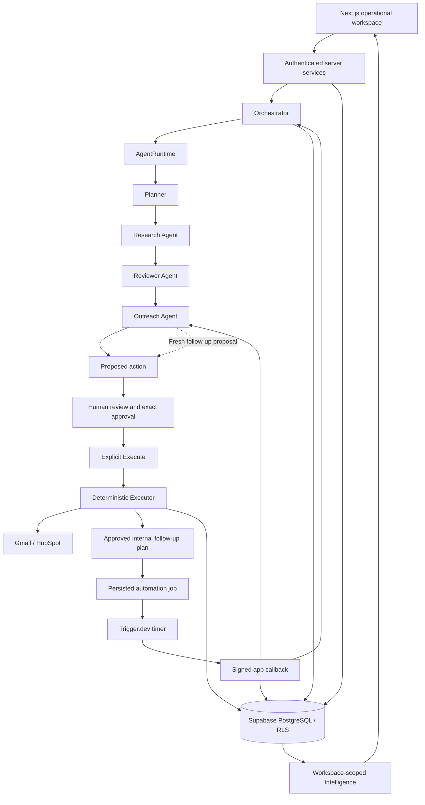

# Architecture

Agentic Ops turns a sales goal into a persisted sequence of bounded, inspectable operations. Supabase owns domain state. The Orchestrator coordinates it; agents produce validated outputs; a deterministic Executor performs separately approved actions.

The diagram describes supported paths, not a guarantee that providers are configured. Research-only workflows omit preparation and external execution. Follow-up preparation can create a new draft but cannot approve or send it.

## Frontend and server boundary

The App Router in `src/app` provides Dashboard, Workflows, Companies, Leads, Approvals, Activity, Automation, Intelligence, ICPs, Templates and Settings. Auth uses email/password and a fixed confirmation callback. Server Components load authenticated data; client components handle forms, filters, drawers, polling and local presentation state. Tailwind, shadcn components, Lucide and Motion support the operational interface.

`src/server/services` checks identity, workspace membership and required owner permissions before constructing repositories or a privileged runtime writer. `requireUser` verifies the session through Supabase `getUser`; `requireWorkspace` resolves the workspace with a cookie-bound client. HTTP mutations validate same-origin requests and strict payloads. Requests carry IDs and expected revisions, not credentials or client-authorized execution envelopes.

The view adapter in `src/lib/workspace-view.ts` translates validated database records into presentation models. Production data is distinct from explicitly labelled sample content. Missing provider configuration and unknown metrics remain visible states.

## Public demo and first run

`/demo` redirects to `/demo/dashboard`. Its own layout mounts DemoStore without a real-workspace snapshot or Auth requirement. The catch-all demo route reuses client presentation for operational screens; sample Automation, Intelligence and strategy views live in `src/components/demo/demo-overview.tsx`. Links preserve the `/demo` namespace. A bounded fixture in `src/lib/demo-fixture.ts` and local storage supply fictional data, decisions and draft creation. No demo record is inserted into Supabase and no timer simulates live progress.

Demo drafts/decisions use browser-only operations. Live actions remain protected by authenticated server services and checked RPCs even though shared client presentation references them. Namespace routing alone is not the authorization boundary. Static sample durations/statuses are labelled; usage/cost and missing assessment details remain unavailable. The shared demo route imports multiple presentation screens, so this approach favors a coherent small showcase over fine-grained route bundle splitting; it is not a claim of optimal bundle size.

Authenticated `/onboarding` offers targeting criteria and the existing workflow form with optional ICP/template. Sign-up with a session opens onboarding; sign-in/email confirmation open Dashboard, which shows the same first-run panel when no workflow exists. Creation goes through the existing server action and opens workflow detail. No onboarding flag/table or second execution path is added.

## Persistence

Supabase Auth, PostgreSQL and versioned migrations provide the persistence layer. Workspace membership policies isolate reads. Checked RPCs repeat authorization, related-record and state guards under row locks, including when called with the service-role runtime client. Preparation/runtime mutations are restricted to their intended roles; browser clients cannot directly manufacture successful runs, approval snapshots or execution attempts.

Core records include workflows, tasks, agent runs/events, canonical companies, company–workflow associations, leads, approvals, proposed actions, immutable approval snapshots, execution attempts, integration connections, follow-up plans and automation jobs. OAuth credentials and claim capabilities are server-only. ICPs/templates belong to a workspace and retain archived history. Source selection captures immutable workflow strategy; lead assessments retain workflow-specific research/qualification snapshots.

Apply migrations in filename order. Never edit already-applied history or reset a hosted workspace to recover from a schema issue. Rollback SQL fixtures in `supabase/tests` test authorization and state invariants without persistent test data or provider calls.

## Orchestration and agents

`Orchestrator` owns workflow progression. It loads saved state before model calls and delegates bounded research/preparation steps to the existing orchestration modules. `AgentRuntime` implements retry policy, usage capture and safe event recording. Agent classes have explicit input/output contracts and do not arbitrarily write application state.

- **Planner** returns a dependency-checked task plan. Atomic completion saves tasks, plan, events and the running workflow together.
- **Research Agent** defines the target profile, discovers candidates, resolves source-supported websites, searches bounded company evidence, validates facts/citations and returns qualification assessments.
- **Reviewer** independently evaluates cited evidence and personalization readiness. A high score alone does not authorize outreach.
- **Outreach** composes a draft from accepted structured evidence. Unknown recipients remain blocked until an operator supplies and confirms one.
- **Executor** uses no model. It loads an exact saved approval, validates readiness, claims and audits dispatch, invokes one provider mutation and records its result.

Planner can use Gemini or the existing OpenAI Responses adapter. Research, Reviewer and Outreach use Gemini; Tavily supplies research evidence. Provider selection and independent model overrides live in `src/server/agents/config.ts`. This is a typed application runtime, not an OpenAI Agents SDK deployment or a generic graph builder. See [agent contracts](agents.md).

## Approval and external actions

Review/edit, Approve and Execute are separate operations. Approval freezes action ID, revision, recipient, content, connection identity/generation, actor/time and digest. Pending edits increment revision; approved edits create a replacement requiring fresh approval. Historical content-only approvals cannot execute.

The Executor uses workflow → action → attempt lock ordering, a claim capability and pre-dispatch audit. A replay returns saved success. An expired dispatch or ambiguous transport result becomes **outcome unknown**; it does not enable blind resend. Bounded recovery saves the same provider response without invoking the mutation again. Gmail's result means provider acceptance, not delivery/read confirmation or exactly-once delivery. HubSpot preview/reconciliation is read-only until a separate exact action is approved and executed.

## Automation

Automation is opt-in. With it disabled, visible workflow pages continue synchronous bounded requests and poll persisted status. Navigating away stops subsequent browser-driven requests after the current request; reopening resumes safely.

With automation enabled, domain transactions save jobs before scheduling. Trigger.dev receives a job reference, then posts an HMAC-signed callback to the fixed application origin. The application verifies timestamp/signature, reloads saved actor/workspace references, rechecks permission and claims the job. Trigger supplies durable timers; PostgreSQL owns retries, leases, cancellation and the outbox. A five-minute maintenance task handles bounded dispatch/recovery. Provider unavailability is not evidence that a worker stopped.

Follow-ups preserve the original plan approver, confirmed parent send and connection generation. A due timer prepares a fresh proposal. Reply checks use only the saved thread's metadata when an existing exact connection has an eligible read grant. Current Gmail OAuth requests send-only access; unavailable monitoring is not interpreted as no response. New mailbox consent is not implemented by this release.

## Observability and Intelligence

Runs retain status, agent/model, duration, retries and nullable observed usage. Safe event summaries describe tasks, tools, outputs, approvals and errors; hidden chain-of-thought and raw provider payloads are excluded. Exact, versioned model pricing enables estimated cost. Missing usage/pricing/category accounting stays unknown; deterministic Executor has no AI cost.

Intelligence is an authenticated security-invoker PostgreSQL aggregate. It returns compact validated data instead of downloading complete event histories. Business outcomes use workflow-creation cohorts and distinct company–workflow units; agent/model activity uses actual run dates. Comparison is bounded and labelled. Analytics reads create no audit events and cannot alter prompts, scores, models or approval policy. See [canonical metric definitions](intelligence-metrics.md).

## Operational limits

Release 0.7 live Trigger worker/recovery and incoming-reply acceptance remain open in the prior verification record. HubSpot owner configuration and exact model pricing also remain prerequisites. Operational lists use bounded windows; larger-volume pagination/retention and historical telemetry gaps remain documented debt. No Calendar, billing, enterprise role system, arbitrary workflow scripting or Release 1.0 deployment is introduced.

Implementation and performed checks are separate claims. Read [Release 0.7 verification](release-0.7-verification.md) and [Release 0.8 verification](release-0.8-verification.md) for the established evidence and unresolved live gates.
